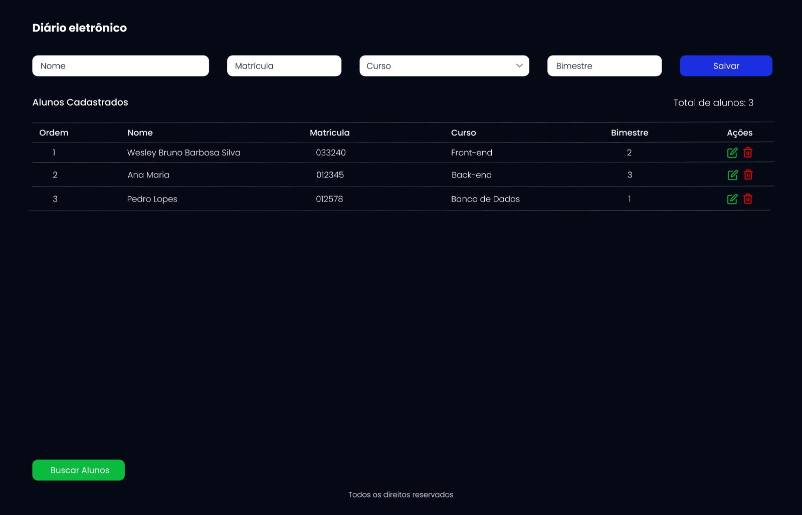

# Projeto Diário alunos

Projeto criado durante a disciplina de Desenvolvimento Web com React do Infnet.

  

Figma: https://www.figma.com/design/MYRL5eJPhlYmZxBLy4bpTX/Untitled?node-id=0-1&t=Tgmush9NdsS71lZf-1

API: https://api-aluno.vercel.app/
